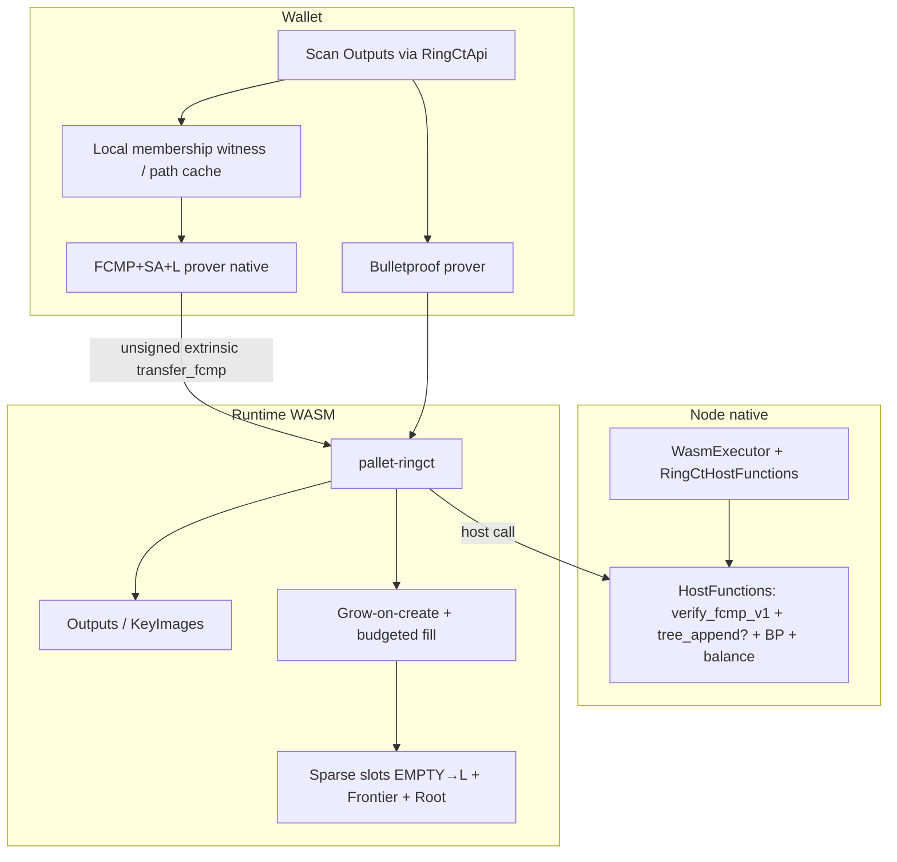
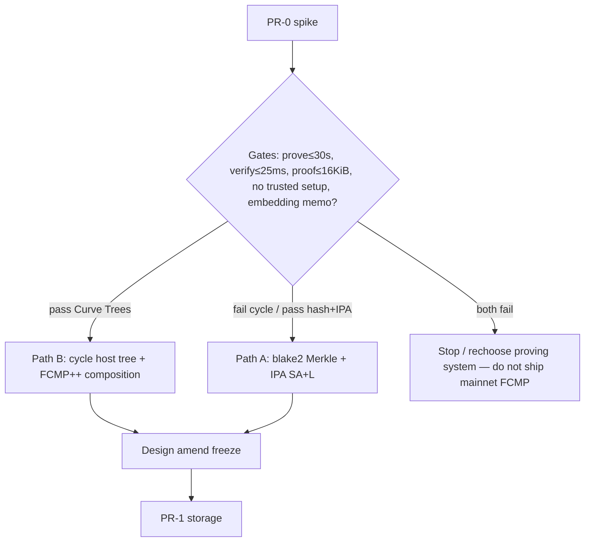
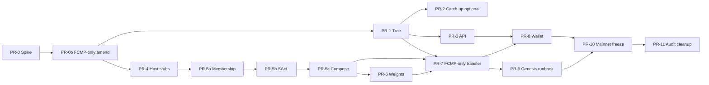

# Full-Chain Membership Proofs (FCMP) for kohl

| Field | Value |
|---|---|
| **Title** | Full-Chain Membership Proofs (FCMP) for kohl |
| **Author** | kohl core (design draft) |
| **Date** | 2026-07-10 |
| **Status** | Draft (**rev 6 — pre-launch FCMP-only, no Dual**); PR-0…10 ✅ · **PR-11 ✅** (hardening + docs; external audit still recommended) |
| **Launch posture** | **Not launched.** No mainnet history to preserve. No forward-compat Dual era. |
| **Supersedes / relates** | `BLUEPRINT.md` §1.2–1.3, §1.6, §9.2–9.3; `GLOSSARY.md` FAQ (rings vs SNARK pools) |
| **Prior art** | Monero FCMP++ (Kayaba / Luke Parker); Curve Trees (eprint 2022/756); Eagen divisors (eprint 2022/596); [fcmp-ringct](https://github.com/kayabaNerve/fcmp-ringct); [Monero FCMP blog](https://www.getmonero.org/2024/04/27/fcmps.html) |

---

## Overview

kohl’s sender anonymity **today (dev code)** is **CLSAG ring signatures of size 16** over Ristretto (`pallet-ringct` + `ringct-crypto`). That gives a *plausible-deniability set of 16*, not cryptographic full-set unlinkability. `BLUEPRINT.md` §9.2–9.3 already names **full-chain membership proofs** as the upgrade path.

**Launch decision (rev 6):** the project is **pre-launch**. There is no economic mainnet history and **no requirement to keep CLSAG spends valid forever**. Therefore:

- **Mainnet (and any “real” public testnet people treat as persistent) is FCMP-only** — one spend path, one signing domain, no Dual.
- CLSAG may remain **only** as a temporary development tool while the membership prover is unfinished; throwaway chains may be **wiped / re-genesised** rather than migrated.
- There is **no** Dual-mode privacy hangover, no multi-era HF schedule, no “keep CLSAG for rollback on mainnet.”

This document specifies how kohl ships **full-chain membership** while preserving:

- Ristretto user keys, stealth addresses, Pedersen amounts, Bulletproofs, and CryptoNote key images
- Unsigned self-authenticating transfers (`AuthorizeCall`)
- Versioned **native host-function** verification (not WASM)
- Fair-launch PoW consensus (RandomX) with reorg-aware tree roots
- **On-chain maturity** for spends (`SpendableAge=10`, `CoinbaseMaturity=60`) without a CLSAG-style ring member scan

**Recommended path:** **kohl-adapted FCMP++ composition** (Curve-Trees-style membership + SA+L with existing key images), or Path A (hash-Merkle + ZK membership) if D2 gates fail — not a Halo2 pool or Seraphis-first migration. Ship in **incremental mergeable PRs**; crypto remains multi-month.

Honest timeline: **PR-0 done → PR-0b freeze → tree + crypto 2–4 months → throwaway FCMP testnet + audit → mainnet FCMP-only genesis (or pre-mainnet reset).** Dual is **out of scope**.

---

## Background & Motivation

### Current state (as implemented)

| Layer | Location | Behavior |
|---|---|---|
| Transfer extrinsic | `pallets/ringct/src/lib.rs` | `transfer(TransferTx)` unsigned via `#[pallet::authorize]`; CLSAG *is* auth |
| Ring input | `RingInput` | `ring: BoundedVec<u64>` (exactly `RingSize=16`), `key_image`, `pseudo_commitment`, `clsag` |
| Signing domain | `SIGNING_DOMAIN = "kohl/transfer/v3"` | `signing_hash` binds rings, KIs, pseudos, outputs, `tx_pubkey`, fee — not range proof / CLSAG bytes |
| Storage | `Outputs`, `NextOutputIndex`, `KeyImages`, `Emitted`, `BlockFees`, `CoinbaseDone` | Append-only TXOs by global `u64` index; KIs never pruned; one coinbase per block |
| Stored leaf | `StoredOutput { one_time_key, commitment, tx_pubkey, view_tag, payload, amount?, height, coinbase }` | CLSAG ring blob uses only `(P, C)`; maturity uses `height` + `coinbase` |
| Maturity | `runtime`: `SpendableAge=10`, `CoinbaseMaturity=60` | Enforced today by reading **every** ring member in `verify_transfer` |
| Crypto | `primitives/ringct-crypto` | CLSAG (`clsag.rs`), stealth, Pedersen/BP; host trait `RingctCrypto` (`verify_clsag_v1`, `verify_range_proof_v1`, `verify_balance_v1`, …) |
| Node wiring | `node/src/service.rs` | `HostFunctions = (SubstrateHostFunctions, RingCtHostFunctions)` |
| Wallet | `wallet/` | Power-law age decoy sampler (`decoy.rs`, `AGE_POWER=1.3`; Monero-gamma stand-in); multi-input builder; always 2 outs |
| Constants | `ringct-primitives` | `MAX_INPUTS/OUTPUTS=8`, `MAX_RING_SIZE=16`, `CLSAG_MAX_BYTES=32*(16+2)` |
| Weights | `pallets/ringct/src/weights.rs` | CLSAG budget ~6 ms/input @ ring 16; BP ~1.5+0.7·outs ms |
| Block limit | `runtime` | ~300 KiB max block length (BLUEPRINT §9.5) |
| Privacy limits | `BLUEPRINT.md` §9.2, `GLOSSARY.md` FAQ | Explicit: rings ≠ Sapling anonymity; FCMP named future work |

Verification pipeline today (`verify_transfer`):

```text
shape + fee floor + point hygiene (tx_pubkey, output OTKs)
→ for each input: ring size/order, KI unspent, every member exists + mature, verify_clsag_v1
→ verify_balance_v1(Σ C', Σ C_out, fee)
→ verify_range_proof_v1
→ apply: insert KIs, append outputs, BlockFees += fee
```

### Pain points

1. **Anonymity set capped at 16** — cannot compete with full-set privacy narratives (Monero FCMP++, Zcash Sapling/Orchard pools).
2. **Decoy quality is a perpetual arms race** — wallet power-law sampler is best-effort; chain cannot enforce “good” decoys.
3. **Reorg + ring composition** — immature rules help, but rings still couple privacy to tip topology.
4. **Competitive honesty** — “Monero-like rings on a new L1” is a weak privacy story once FCMP++ is public knowledge.

### Why not “just copy Monero FCMP++ binary”?

- kohl is **Ristretto everywhere**, not raw ed25519 → no Monero address/tx compatibility either way (`BLUEPRINT.md` §2.2). Ristretto is a prime-order *group abstraction*, not a Pasta-style cycle participant.
- Heavy crypto is already a **Substrate host-function** boundary with versioning — design must extend that pattern, not ship foreign C++ into WASM.
- kohl can **reuse outputs + key images** and avoid a Seraphis address migration if it follows FCMP++’s “no Seraphis first” philosophy.

---

## Goals & Non-Goals

### Goals

1. **Full mature-set membership**: each spend proves the real input is one of *all outputs the chain has admitted into the membership tree* (admitted ⇔ mature under the same rules as CLSAG; see D11 sparse admission — **not** blocked by immature lower-index coinbases), not a wallet-chosen ring of 16.
2. **Keep CryptoNote linkability**: same key-image semantics `I = x·Hp(P)` (identical to `clsag::key_image`) so double-spend detection and historical KI set remain valid.
3. **No trusted setup** if feasible (aligns with rings + Bulletproofs ethos) — hard gate in D2.
4. **Preserve receiver privacy and amount privacy** (stealth + BP) unchanged in first FCMP generation.
5. **On-chain maturity parity** with CLSAG for both normal and coinbase outputs (no CoinbaseMaturity bypass).
6. **Substrate-production constraints**: host-function verify path, block weight, unsigned validation, PoW reorg safety.
7. **Incremental delivery** of code (tree scaffolding before prover, KATs before pallet enablement); each PR mergeable.
8. **Mainnet FCMP-only**: no Dual, no long-lived CLSAG era on economic history.
9. **Pre-launch freedom**: encoding, extrinsic layout, and host ABIs may break until mainnet freeze; prefer **re-genesis** over migration for throwaway testnets.

### Non-Goals (v1 FCMP)

- Monero wire compatibility or shared addresses.
- Seraphis / Jamtis address format (track as optional later; not blocking FCMP).
- Replacing Bulletproofs with circuit range proofs.
- Optional privacy / transparent pool.
- Quantum-safe signatures / FCMP++ “forward secrecy” wallet features at launch.
- **Dual-mode** coexistence of CLSAG and FCMP on the same economic chain.
- **Forward-compatible migration** of mainnet CLSAG history (there will be none).
- Keeping CLSAG as a mainnet emergency rollback path (re-genesis / coordinated restart is acceptable pre- and at-launch; post-launch policy is a separate product decision).
- Shipping complete FCMP in one PR or mainnet before composition review + weights.
- Revealing spent-output age/height on chain (maturity is enforced by tree admission, not by opening height).

---

## Key Decisions

| # | Decision | Rationale |
|---|---|---|
| **D1** | **Proving approach: FCMP++-style Curve Trees + SA+L** as the *headline* path; **A5 (hash-Merkle + IPA)** is the explicit fallback if PR-0 gates fail | Reuses output+KI model; no trusted setup goal; closest to blueprint §9.3; gates prevent locking an infeasible stack |
| **D2** | **User crypto stays Ristretto**; cycle arithmetic (if any) is **host-`std` only** with a written embedding argument; PR-0 has **quantitative go/no-go** | Cycle is *not* a small detail — it dominates proof size, verify time, audit surface, and transferability of Monero artifacts. Gates: prove ≤ 30 s/input laptop; verify ≤ 25 ms/input native; proof ≤ 16 KiB/input; **no trusted setup**; embedding security memo. Fail → A5 or stop/rechoose system |
| **D3** | **Replace CLSAG with FCMP+SA+L** (membership ⊕ spend auth ⊕ linkability) | Membership-only still needs auth+link; composition is the CLSAG drop-in; no stacked CLSAG |
| **D4** | **Keep CryptoNote key images** as permanent nullifiers | Zero migration of `KeyImages`; deterministic double-spend across eras; KAT: `fcmp` KI == `clsag::key_image(sk)` |
| **D5** | **Indexed sparse tree:** slot `i` aligns with global output index `i`; leaf is `EMPTY` until admitted, then `L(Outputs[i])`; roots in storage; reorg = state rollback | Preserves index↔output map; allows out-of-order maturity fill (D11) |
| **D6** | **Single spend extrinsic** for production: FCMP types (`TransferTx` replaced or renamed); signing domain **`kohl/transfer/v4`** (or later). CLSAG `v3` path **removed** before mainnet | Pre-launch: no need to overload or dual-encode; one message format |
| **D7** | **Dev modes only: `ClsagDev` → `Building` → `FcmpOnly`.** **No Dual.** Mainnet genesis is `FcmpOnly` | Pre-launch; wipe/re-genesis instead of coexisting spend paths |
| **D8** | **Throwaway history:** CLSAG-era dev outputs are **not** migrated onto mainnet. Prefer **fresh genesis** (or full chain reset) when enabling FCMP for any persistent network. Tree backfill exists only for mid-dev restarts of the *same* throwaway chain | Avoids Monero-style decade migration |
| **D9** | **Proving targets (engineering goals):** ≤ 10–30 s/input prove; ≤ 15–25 ms verify; ≤ 2–4 GiB prove RAM | Commodity hardware; public fail if multi-minute |
| **D10** | **Versioned host functions** for FCMP verify (and tree append if not pure-hash); node binary must match runtime at mainnet freeze | BLUEPRINT §1.6; simpler without multi-era host matrices |
| **D11** | **Maturity via sparse delayed admission:** when mature, update slot `i` to `L(P,C)` without waiting on other indices. Slot `i` becomes `EMPTY` via lag-aware grow (D16). Membership opens only **non-`EMPTY`** leaves | Membership ⇒ mature; parity with current age rules; no sequential HOL blocking |
| **D12** | **Tree maintenance locus:** Path A maintenance → pure runtime `blake2_256`; Path B cycle → host only. Membership **proofs** are ZK (D17) | Consensus-split avoidance |
| **D13** | **One `membership_root` per transaction** | Simpler wallet; all inputs share one anchor |
| **D14** | **Mainnet / persistent-testnet FCMP enablement only after:** (1) composition external review memo, (2) FCMP weights merged, (3) throwaway FCMP-only testnet soak. **No Dual gate.** Unsound FCMP is critical (false spends under BP+balance) | Replaces old Dual checklist |
| **D15** | **Interim FCMP caps:** `MAX_FCMP_INPUTS = 4`; `MAX_FCMP_PROOF_BYTES = 12_288` provisional | Fit ~300 KiB blocks |
| **D16** | **Split grow vs fill + lag-aware create** (same mechanics as rev 5): grow-on-create when `TreeSlots == i`; lag → catch-up only; fill-first admit budget; catch-up grow after fill | Correctness under reorg / mid-dev tree enable — **not** a mainnet Dual concern |
| **D17** | **Path A membership is zero-knowledge w.r.t. index and leaf** — transparent Merkle paths are not valid `π` | Open paths would reveal the spent index |
| **D18** | **Pre-launch breakage is allowed** until mainnet encoding freeze (after PR-0b + crypto stabilize). No commitment to replaying old CLSAG extrinsics on mainnet | Project not launched |

---

## Proposed Design

### High-level architecture



### Maturity enforcement (consensus-critical)

Today CLSAG enforces maturity by loading every ring member. FCMP has no ring. **Root-window alone is insufficient:** a root that already contains a coinbase leaf would allow early coinbase spend if that leaf were inserted at creation time.

**Chosen mechanism (D11): sparse delayed admission (indexed, non-blocking)**

Kohl’s dual constants (`SpendableAge=10`, `CoinbaseMaturity=60`) interact with block layout: coinbase is typically the **first** output(s) of a block (lower global indices), then transfer outputs. A **dense sequential** admit that `break`s on the first immature index would stall every later transfer behind the immature coinbase until `H+60`, making all FCMP spends effectively 60-block-locked — contradicting CLSAG parity and the claim that “normal outputs wait 10.”

```text
Invariant (Building complete / steady state):
  TreeSlots = NextOutputIndex                    // one slot per existing output
  for all i < TreeSlots:
    if !Admitted[i]:  leaf_i = EMPTY
    if  Admitted[i]:  leaf_i = L(Outputs[i].P, Outputs[i].C)
                      and Outputs[i] is mature under its own rule
  Membership proof may only open a non-EMPTY leaf under root R
  ⇒ membership implies maturity (no early spend)
```

**Lifecycle of slot `i` (consensus — must match code):**

1. **Create** (`apply_transfer` / `coinbase` after writing `Outputs[i]`): call lag-aware `maybe_grow_empty_on_create(i)` (D16):
   - **Steady state** (`TreeSlots == i`): `tree_grow_empty(i)`; `TreeSlots = i+1`. Weight on **that extrinsic** (≤ outs written). Not paid from fill budget.
   - **Lag mode** (`TreeSlots < i`): **do not grow** tip out of order; mint only appends `Outputs`. Catch-up grow will create `EMPTY` for `i` when the sequential cursor reaches `i`.
   - **Forbidden:** `TreeSlots > i` (would mean double-grow / index reuse).
2. **Admit / fill** (end of block): when mature and `i < TreeSlots`, `tree_update(i, L(P,C))`; set `Admitted[i]`. Independent of whether `j < i` is still `EMPTY`. Cap: `FCMP_ADMIT_MAX_LEAVES_PER_BLOCK` only.
3. **Spend**: FCMP opens non-`EMPTY` leaf; KI nullifies as today. Leaf **stays** `L(P,C)`.

**Modes for `TreeSlots` vs `NextOutputIndex`:**

| Mode | Condition | Who advances `TreeSlots` |
|---|---|---|
| **Steady state** | `TreeSlots == NextOutputIndex` after each mint | Live grow-on-create only |
| **Lag mode** | `TreeSlots < NextOutputIndex` (Building HF start, deep reorg recovery) | **Catch-up grow only** (sequential from `TreeSlots`); mints skip grow |
| Building complete / FcmpOnly ready | `TreeSlots == NextOutputIndex` **and** all currently mature indices `Admitted` | Steady state resumes |

**Algorithms (D16):**

```rust
const FCMP_ADMIT_MAX_LEAVES_PER_BLOCK: u32 = 64; // EMPTY → L fills only
const FCMP_GROW_CATCHUP_MAX_PER_BLOCK: u32 = 64; // lag-mode sequential grow only

fn is_mature<T: Config>(out: &StoredOutput<_>, now: BlockNumberFor<T>) -> bool {
    let age = if out.coinbase { T::CoinbaseMaturity::get() } else { T::SpendableAge::get() };
    now >= out.height + age
}

/// Called from apply_transfer / coinbase after Outputs[i] is inserted.
fn maybe_grow_empty_on_create(i: u64) {
    let slots = TreeSlots::get();
    if slots == i {
        // Steady state: tip mint extends the dense slot prefix.
        tree_grow_empty(i); // leaf = EMPTY
        TreeSlots::put(i + 1);
    } else {
        // Lag mode (Building HF / reorg): historical gap TreeSlots..i-1 not yet grown.
        // Do NOT grow tip i out of order — catch-up will reach i later.
        debug_assert!(slots < i);
        // no tree mutation here
    }
}

/// End of block: (1) always fill up to ADMIT budget; (2) catch-up grow if lagging.
fn admit_mature_leaves<T: Config>() {
    let now = frame_system::Pallet::<T>::block_number();

    // --- A) Fill first (never starved by grow) ---
    let mut fill_budget = FCMP_ADMIT_MAX_LEAVES_PER_BLOCK;
    while fill_budget > 0 {
        let Some(i) = next_admittable_index::<T>(now) else { break }; // mature ∧ !Admitted[i] ∧ i < TreeSlots
        let out = Outputs::<T>::get(i).expect("admittable ⇒ exists");
        debug_assert!(is_mature::<T>(&out, now));
        tree_update(i, L(out.one_time_key, out.commitment)); // EMPTY → L(P,C)
        Admitted::<T>::insert(i, ());
        fill_budget -= 1;
    }

    // --- B) Catch-up grow: sole TreeSlots advancer while TreeSlots < NextOutputIndex ---
    let mut grow_budget = FCMP_GROW_CATCHUP_MAX_PER_BLOCK;
    let next_out = NextOutputIndex::<T>::get();
    while TreeSlots::<T>::get() < next_out && grow_budget > 0 {
        let i = TreeSlots::<T>::get();
        // Outputs[i] must exist (minted earlier, possibly during lag without grow).
        debug_assert!(Outputs::<T>::contains_key(i));
        tree_grow_empty(i);
        TreeSlots::<T>::put(i + 1);
        grow_budget -= 1;
        // Newly grown EMPTY may be mature → fillable next block (v1 OK).
    }

    // update MembershipRoot / Frontier / MembershipRootAt(now)
}
```

`next_admittable_index` returns mature un-admitted `i < TreeSlots` (**lowest index first**). Still admits transfer `i+1` at age 10 while coinbase `i` remains `EMPTY` until age 60.

**Why not shared grow-first budget (rev 3):** high outs/block starves fills.  
**Why not unconditional grow-on-create (rev 4 hole, fixed rev 5):** at HF1 `TreeSlots=0` while tip `i` is large → `assert i == TreeSlots` panics, or out-of-order grow breaks dense `0..TreeSlots`.

Consequences:

- **Membership ⇒ mature** without revealing age/height.
- **CLSAG parity** for normal vs coinbase once slots exist and are filled.
- During Building lag, tip outputs exist in `Outputs` but have **no tree slot** until catch-up reaches them — cannot be FCMP-spent until grown + mature + filled (in Building, only CLSAG spends apply on throwaway chains).
- Steady-state fill lag only from many indices maturing same block (fill budget), not from mint rate.
- **Test vectors (required):**
  1. Coinbase spend before age 60 → fail.
  2. Coinbase at age 60 after fill → success.
  3. Transfer age 10 with immature preceding coinbase → FCMP-admitted (steady state / after slots exist).
  4. Transparent Merkle path → reject (D17).
  5. **Steady state:** block with 80 new outs still runs full fill budget; after those mints `TreeSlots == NextOutputIndex` without finalize grow.
  6. **Building lag:** after HF with `TreeSlots=0` and large `NextOutputIndex`, a live mint at tip **does not panic**, does not grow out-of-order; `TreeSlots` only advances via catch-up; that tip index is eventually grown when cursor reaches it.
  7. Fill runs before catch-up grow each block (mature backlog not zeroed by catch-up).

**Rejected alternatives:**

- *(sequential dense prefix for maturity)* — HOL by immature coinbase; rejected rev 3.
- *(shared grow-first finalize budget)* — starves fills; rejected rev 4.
- *(unconditional grow-on-create with assert `i == TreeSlots`)* — breaks Building; **rejected rev 5**.
- *(grow tip out-of-order while lagging)* — holes in `0..TreeSlots`; rejected.
- *(a) Height in leaf + prove maturity* — age privacy risk.
- *(c) Dual trees* — unnecessary with sparse single tree.

### Proof statement (consensus-critical)

This subsection freezes the **relation** implementers and auditors must meet. PR-4 host ABI is **provisional** until this statement and PR-0 encoding are fixed; PR-5 must not ship without KATs against it.

#### Public inputs (per input, plus tx-level)

| Symbol | Meaning | Source |
|---|---|---|
| `msg` | `signing_hash_fcmp(tx)` — 32 bytes | Runtime / wallet |
| `R` | membership root (tx-level, one per tx) | `FcmpTransferTx.membership_root` |
| `C'` | pseudo-output commitment | `FcmpInput.pseudo_commitment` |
| `I` | key image | `FcmpInput.key_image` |
| `π` | proof blob | `FcmpInput.fcmp_proof` |

Tx-level also publicly includes outputs, `tx_pubkey`, `fee` via `msg` binding (not re-passed into `verify_fcmp_v1` beyond `msg`).

#### Witness (secret)

| Symbol | Meaning |
|---|---|
| `ℓ` | global output index of real spend (`Admitted[ℓ]` under anchor root `R`) |
| `P` | one-time public key at leaf `ℓ` |
| `C` | Pedersen commitment at leaf `ℓ` |
| `x` | one-time secret: `P = x·G` |
| `a` | amount (for prover constructing `C'`; not opened) |
| `x_in` | input blinding of `C` |
| `x'` | pseudo blinding of `C'` |
| `z` | `x_in − x'` so `C − C' = z·G` (Monero/kohl convention: blinding on `G`, value on `H`) |
| tree auth path / Curve Tree witness for leaf `ℓ` under root `R` | |

#### Relation \(\mathcal{R}\)

Accept `(msg, R, C', I; π)` iff ∃ witness such that:

1. **Leaf well-formed & membership (index-hiding)**  
   At some **undisclosed** index `ℓ`, the tree under root `R` stores a **non-`EMPTY`** leaf equal to `L(P, C)` (tree parameters in “Leaf & tree encoding”).  
   `P`, `C` are canonical non-identity Ristretto encodings (same hygiene class as today).  
   The membership sub-argument in `π` must be **zero-knowledge w.r.t. `ℓ` and the leaf** (D17): a transparent Merkle authentication path is **not** a valid encoding of `π`.

2. **Spend authorization**  
   `P = x·G` for secret scalar `x` (Ristretto basepoint `G` as in `clsag` / Pedersen gens).

3. **Linkability (key image)** — **identical** to current CLSAG domain:  
   `I = x · Hp(P)` where `Hp` is `kohl/clsag/hp/v1` hash-to-Ristretto as in `clsag.rs` (`hp` over compressed `P` bytes).  
   **KAT requirement:** for any test secret, `fcmp` derived `I` bytes equal `clsag::key_image(sk)`.

4. **Amount re-blinding**  
   `C − C' = z·G` for some scalar `z` (commitment-to-zero difference on the blinding base).  
   Equivalent to CLSAG’s commitment aggregate relation without publishing the ring.

5. **Message binding (SA)**  
   Fiat–Shamir / transcript includes `msg` and all public inputs `(R, C', I)` so the proof cannot be rebound to another tx body.

6. **Key-image canonicity**  
   `I` decodes as a non-identity Ristretto point (Ristretto removes small-order torsion classes that plagued raw ed25519; still reject identity / non-canonical encodings explicitly in verify).

The verifier does **not** learn `ℓ`, `P`, `C`, `x`, or `z`.

#### CLSAG → SA+L mapping

| CLSAG (`clsag.rs`) | FCMP SA+L |
|---|---|
| Ring blob `n×(P‖C)`; hide index `l` among 16 | Membership proof hide index among admitted (non-`EMPTY`) leaves under `R` |
| `P_l = x·G` in round challenges | SA: PoK of `x` for opened `P` from membership |
| `I = x·Hp(P)` | Same formula + domain `kohl/clsag/hp/v1` |
| `C_l − C' = z·G`; μ-aggregated with key | Explicit amount-link argument in composition |
| `c0 ‖ s_i ‖ D` | Opaque `π` (structure internal to fcmp module) |
| Domains `kohl/clsag/agg-key|agg-com|round|hp/v1` | New domains `kohl/fcmp/*` for membership/SA transcripts; **reuse** `hp/v1` for KI only |

#### Domain-separation checklist (must not collide)

| Tag | Purpose |
|---|---|
| `kohl/transfer/v3` | Legacy CLSAG signing hash only |
| `kohl/transfer/v4` | FCMP signing hash only |
| `kohl/clsag/*` | Legacy CLSAG only (except shared `hp` for KI) |
| `kohl/rangeproof/v1` | Bulletproof transcript (unchanged) |
| `kohl/fcmp/leaf/v1` | Leaf preimage domain (hash path) |
| `kohl/fcmp/merkle/v1` | Merkle node hash domain (A5) |
| `kohl/fcmp/fs/v1` | FCMP Fiat–Shamir transcript root label |
| `kohl/fcmp/sa/v1` | Spend-auth sub-transcript |
| `kohl/fcmp/link/v1` | Linkability sub-transcript |
| `kohl/fcmp/amt/v1` | Amount re-blind sub-transcript |

#### `signing_hash_fcmp`

```text
msg = blake2_256(SCALE(
  FCMP_SIGNING_DOMAIN,          // b"kohl/transfer/v4"
  membership_root,              // single root, D13
  key_images[],                 // ordered as inputs
  pseudo_commitments[],
  outputs,
  tx_pubkey,
  fee
))
```

**Excluded from msg (bound by their own transcripts / verify):** `fcmp_proof` bytes, `range_proof` bytes.  
**Malleability note:** alternative accepting proofs for the same statement change the extrinsic encoding; treat **canonical tx identity** for off-chain purposes as `msg` (or KI set), not raw extrinsic hash, unless a later malleability-hardening revision includes a proof commitment in `msg` (non-goal for v1).

### Leaf & tree encoding (consensus-critical)

`domain || P || C` as a *literal Curve Tree leaf* is **not** sufficient: Curve Trees commit to curve points / field elements, not arbitrary strings. Encoding is path-dependent.

#### Shared leaf preimage

```text
// Consensus domain string (not forced to 16 bytes — unlike signing domains)
LEAF_DOM = b"kohl/fcmp/leaf/v1"
preimage(P, C) = LEAF_DOM || P || C
// P, C = 32-byte compressed Ristretto (dalek compressed encoding), as stored in Outputs
// Coinbase C is value_commitment_v1(amount) already stored — no special case
```

Do **not** bind `tx_pubkey`, `view_tag`, `payload`, `height`, or `coinbase` into the leaf (maturity is D11; scan metadata stays out).

#### Path A — Hash-Merkle tree + **ZK** membership (A5 fallback; Building may use same tree)

Tree **maintenance** is pure-runtime blake2 (cheap). Tree **membership proofs** are the hard part: they must hide the index.

| Parameter | Value |
|---|---|
| Occupied leaf digest | `leaf_hash = blake2_256(preimage(P,C))` → 32 bytes |
| Placeholder leaf | `EMPTY = blake2_256(b"kohl/fcmp/leaf/empty/v1")` (immature / not yet admitted) |
| Arity | Binary (`FCMP_TREE_ARITY = 2`) |
| Node hash | `blake2_256(b"kohl/fcmp/merkle/v1" \|\| left \|\| right)` |
| Missing child (beyond `TreeSlots`) | `blake2_256(b"kohl/fcmp/merkle/v1/empty")` fixed sentinel (distinct from leaf `EMPTY` if needed for depth padding) |
| Empty tree root (`TreeSlots=0`) | document constant `EMPTY_MEMBERSHIP_ROOT` |
| Max slots | `2^32` engineering bound (depth ≤ 32) |
| Root storage | exactly `[u8; 32]` |
| Frontier / sparse state | Merkle peaks or sparse frontier codec, `MaxEncodedLen` bounded by depth |
| Grow / update locus | **pure runtime** (D12): `tree_grow_empty(i)`, `tree_update(i, L)` |

**Consensus rule (D17) — index-hiding membership:**

- Verifier **must not** accept an open Merkle path `(path_bits, siblings, leaf_hash)` as `π` or as a public subfield of `π`.
- Membership sub-proof proves, in zero knowledge: ∃ `(ℓ, P, C, auth_path)` such that Merkle-verify(`R`, `ℓ`, `blake2_256(preimage(P,C))`, path) = 1 **and** leaf ≠ `EMPTY` encoding, without revealing `ℓ` or path bits.
- Intended argument class: **Bulletproof/IPA (or equivalent transparent ZK) circuit over Merkle path verification**, composed with SA+L under `kohl/fcmp/fs/v1`. Exact circuit is PR-0/5a work; the **requirement** is consensus-critical now.
- **Negative KAT:** any encoding that is only a transparent path under a fixed test root → `verify_fcmp_v1` returns false.
- Path A implementation risk is **ZK-Merkle composition**, not frontier bookkeeping.

Then SA+L links the same `(P,C)` as in \(\mathcal{R}\).

#### Path B — Curve Trees (headline if PR-0 passes)

| Parameter | Value |
|---|---|
| Leaf | Map occupied `(P,C)` → cycle-field elements / points per pinned Curve Trees instantiation; **must** be a deterministic, injective (or collision-hardened) embedding of the 64-byte `(P,C)` pair; **`EMPTY` placeholder** has a fixed distinct embedding so immature slots exist without being spendable |
| Embedding | Written security memo in PR-0: no discrete-log trapdoors; domain-separated; rejects non-canonical Ristretto |
| Arity / depth | From spike (e.g. arity 4/8); constants in `ringct-primitives` after design amend |
| Root serialization | Prefer compress to 32 bytes; if larger, use fixed `MembershipRootBlob` with `MaxEncodedLen` and update all APIs |
| Empty tree | Explicit genesis root constant from the tree crate |
| Grow / update locus | **host** `membership_tree_grow_empty_v1` / `membership_tree_update_v1` (D12); sparse admit semantics same as Path A |
| Index hiding | Curve Trees membership is designed to hide leaf position; still must reject any debug/transparent opening encoding in `π` |

PR-0 must pin: cycle crate versions, generators, and whether Monero `fcmp-ringct` / monero-oxide artifacts are evaluation targets only (license + Ristretto rewrite required — no byte-compatible import).

#### Design amend checkpoint (PR-0b / rev 6)

| Freeze now | Do not freeze yet |
|---|---|
| Path A **maintenance** domains (`L` preimage, EMPTY, merkle node, empty root, arity 2) | Path B cycle leaf embedding |
| Pure-runtime append for Path A tree ops | Final `MAX_FCMP_PROOF_BYTES` (keep D15 provisional) |
| **No Dual**; mainnet FCMP-only; throwaway re-genesis | `verify_fcmp_v1` full ABI (until PR-5c) |
| Pre-launch breakage allowed (D18) | Mainnet encoding freeze date |

**Do not merge PR-1 storage layouts that contradict Path A maintenance freezes.**

### Curve / group story (detailed)

| Component | Group | Where it runs |
|---|---|---|
| One-time keys `P`, key images `I`, Pedersen `C`, BP gens | **Ristretto** (`curve25519-dalek`) | Wallet + host |
| CLSAG (legacy) | Ristretto | Host `verify_clsag_v1` |
| Membership (Path B) | Pinned cycle + embedding of Ristretto `(P,C)` | Host prove/verify **only** |
| Membership (Path A) | blake2 Merkle maintenance + **ZK-IPA Merkle membership** + SA | Runtime Merkle updates; host/wallet for ZK prove/verify |
| Stored roots | Opaque 32-byte digests (or fixed blob) | WASM-safe |



**Rejected:** moving user keys off Ristretto.

### Tree / accumulator maintenance

#### Storage (pallet additions)

```rust
#[pallet::storage]
pub type MembershipRoot<T> = StorageValue<_, [u8; 32], ValueQuery>; // or RootBlob after amend

#[pallet::storage]
pub type MembershipFrontier<T> =
    StorageValue<_, BoundedVec<u8, ConstU32<MAX_FRONTIER_BYTES>>, ValueQuery>;

/// Number of tree slots (== how far we have grown; tracks `NextOutputIndex` under budget).
#[pallet::storage]
pub type TreeSlots<T> = StorageValue<_, u64, ValueQuery>;

/// Whether slot `i` has been updated from EMPTY → L(P,C). Presence = admitted.
#[pallet::storage]
pub type Admitted<T> = StorageMap<_, Twox64Concat, u64, (), OptionQuery>;

#[pallet::storage]
pub type FcmpMode<T> = StorageValue<_, FcmpMode, ValueQuery>;

/// Root at end of block N (written every block once Building started).
#[pallet::storage]
pub type MembershipRootAt<T> =
    StorageMap<_, Twox64Concat, BlockNumberFor<T>, [u8; 32], OptionQuery>;

/// Optional: next index to scan for admit/migration resume (deterministic cursor; not a dense-prefix barrier).
#[pallet::storage]
pub type AdmitScanCursor<T> = StorageValue<_, u64, ValueQuery>;
```

#### Who updates the root?

**Runtime transactional boundary** with `NextOutputIndex` / block hooks (D16):

1. **Live mint path:** `apply_transfer` / `coinbase` append `Outputs[i]` then `maybe_grow_empty_on_create(i)`:
   - if `TreeSlots == i` → grow EMPTY (steady state);
   - if `TreeSlots < i` → no tree op (lag mode; catch-up owns `TreeSlots`).
2. **End of block:** fill first (`EMPTY→L` ≤ `FCMP_ADMIT_MAX`); then if still lagging, catch-up grow ≤ `FCMP_GROW_CATCHUP_MAX` — never instead of fill.
3. **Every block** after Building starts: `MembershipRootAt::insert(now, root)`; prune outside `FCMP_ROOT_MAX_AGE`.

Roots change when slots grow (create or catch-up) or fills land — recorded every block (may repeat).

**Weight:**

| Op | Charged to | Bound |
|---|---|---|
| `tree_grow_empty` on create (only if `TreeSlots == i`) | `transfer` / `transfer_fcmp` / `coinbase` | ≤ outs that actually grew |
| `tree_update` fill | `on_finalize` | ≤ `FCMP_ADMIT_MAX_LEAVES_PER_BLOCK` |
| Catch-up grow | `on_finalize` | ≤ `FCMP_GROW_CATCHUP_MAX_PER_BLOCK` |

Unfinished fills / catch-up continue next block. Include in PR-weights before FcmpOnly enablement.

### Provable root selection & reorg

#### Anchor rules (v1)

1. Tx carries **one** `membership_root` (D13).
2. Runtime accepts iff ∃ `h` with:
   - `MembershipRootAt::get(h) == membership_root`
   - `h ∈ [tip.saturating_sub(FCMP_ROOT_MAX_AGE_BLOCKS), tip.saturating_sub(FCMP_ROOT_MIN_DEPTH)]`
3. Provisional constants:
   - `FCMP_ROOT_MAX_AGE_BLOCKS = 64` (align with pool longevity)
   - `FCMP_ROOT_MIN_DEPTH = 0` for root age only — **maturity is D11 sparse admission**, not min-depth. Default **0** is OK: immature slots are `EMPTY` and cannot be opened.
4. **Pool longevity** for `transfer_fcmp`: set `ValidTransaction::longevity = FCMP_ROOT_MAX_AGE_BLOCKS` (not longer), so pool entries expire before anchors fall out of the window. Legacy CLSAG may keep 64 independently.

#### Reorg behavior

| Event | Chain | Wallet |
|---|---|---|
| Shallow reorg | State trie rewinds frontier, `TreeSlots`, `Admitted`, `MembershipRootAt` | If anchor `h` still on new chain and root matches, txs may still verify; else `RootStale` |
| Deep reorg past anchor | Roots vanish / differ | **Resync algorithm:** (1) detect best-hash change past last trusted block; (2) re-fetch `outputs_in_range` from reorg common ancestor; (3) rebuild local witness cache from `membership_frontier` RPC or incremental peaks; (4) re-prove |
| Mid-block roots | Not published; only end-of-block `MembershipRootAt` | Prove only against end-of-block roots |

### What replaces CLSAG

| Era | Auth object | Nullifier | Amount link |
|---|---|---|---|
| Current | CLSAG over 16×`(P,C)` | `I = x·Hp(P)` | `C − C' = z·G` inside CLSAG |
| FCMP | FCMP+SA+L proof blob | **same** `I` | same relation in SA+L |
| Coexistence | either extrinsic | shared `KeyImages` | shared balance equation |

**Do not keep CLSAG as a second membership layer.** Pre-launch: remove CLSAG spend path before mainnet; never stack CLSAG under FCMP.

### Transaction format

```rust
/// Exactly 16 bytes. Wallets MUST NOT use v3 hashing for FCMP.
pub const FCMP_SIGNING_DOMAIN: [u8; 16] = *b"kohl/transfer/v4";

pub struct FcmpInput {
    pub key_image: [u8; 32],
    pub pseudo_commitment: [u8; 32],
    pub fcmp_proof: BoundedVec<u8, ConstU32<MAX_FCMP_PROOF_BYTES>>,
}

pub struct FcmpTransferTx {
    /// Single anchor for all inputs (D13).
    pub membership_root: [u8; 32],
    pub inputs: BoundedVec<FcmpInput, ConstU32<MAX_FCMP_INPUTS>>, // not MAX_INPUTS
    pub outputs: BoundedVec<Output, ConstU32<MAX_OUTPUTS>>,
    pub tx_pubkey: [u8; 32],
    pub range_proof: BoundedVec<u8, ConstU32<MAX_RANGE_PROOF_BYTES>>,
    pub fee: u64,
}
```

#### Authorize vs dispatch

| Check | Authorize (pool) | Dispatch |
|---|---|---|
| Mode is `FcmpOnly` (production) | **Yes** — reject if Building/ClsagDev | Yes |
| Fee ≥ min per encoded byte | Yes | Yes |
| `inputs.len() ≤ MAX_FCMP_INPUTS` | Yes | Yes |
| Each proof `len ≤ MAX_FCMP_PROOF_BYTES` | Yes | Yes |
| KI unspent + unique sorted | Yes (`provides`) | Yes |
| Root in window | **Best-effort:** reject if root ≠ any `MembershipRootAt` in window (cheap map probes) | Full |
| `verify_fcmp_v1` | No (expensive) | Yes |
| Balance + BP | No | Yes |

#### Constants (`ringct-primitives`)

```rust
pub const MAX_FCMP_INPUTS: u32 = 4;           // interim D15; revisit after benches
pub const MAX_FCMP_PROOF_BYTES: u32 = 12_288; // 12 KiB provisional
pub const FCMP_ROOT_MAX_AGE_BLOCKS: u32 = 64;
/// Hard cap on EMPTY→L fills per block (finalize only; never shared with live grow).
pub const FCMP_ADMIT_MAX_LEAVES_PER_BLOCK: u32 = 64;
/// Hard cap on historical/reorg EMPTY grow per block (separate from fill; fill runs first).
pub const FCMP_GROW_CATCHUP_MAX_PER_BLOCK: u32 = 64;
// MAX_RING_SIZE / CLSAG_MAX_BYTES: remove from production runtime before mainnet freeze
```

**Block-size formula (engineering):**  
`worst_fcmp_body ≈ MAX_FCMP_INPUTS * MAX_FCMP_PROOF_BYTES + BP + outs + overhead`  
≤ `4 * 12288 + ~1 KiB + … ≈ 50 KiB` per tx provisional — leaves headroom under 300 KiB for multiple txs. If benches yield larger proofs, cut `MAX_FCMP_INPUTS` to 2 before mainnet.

### Verification pipeline (FCMP path — production)

```text
1. Mode is FcmpOnly (else reject — no Dual fallback)
2. Shape: 1..=MAX_FCMP_INPUTS inputs, ≥1 output; fee floor; point hygiene
3. Inputs strictly sorted unique by key_image
4. membership_root in accepted window (MembershipRootAt)
5. For each input:
   a. KI not spent; I canonical non-identity Ristretto
   b. proof length bounds
   c. host verify_fcmp_v1(msg, root, C', I, proof)  // relation R
6. verify_balance_v1; verify_range_proof_v1
7. apply: insert KIs; append Outputs **with maybe_grow_empty_on_create per new index** (no-op if lagging); BlockFees; events
   (end of block: fill EMPTY→L, then catch-up grow if lagging)
```

Maturity is **implied** by membership opening a non-`EMPTY` admitted leaf (D11) — no per-input `Outputs` maturity loop.

### Host functions

```rust
/// Provisional ABI until proof statement + Path A/B freeze.
fn verify_fcmp_v1(
    msg: PassFatPointerAndRead<&[u8]>,              // 32-byte msg expected
    membership_root: PassFatPointerAndRead<&[u8]>,
    pseudo_commitment: PassFatPointerAndRead<&[u8]>,
    key_image: PassFatPointerAndRead<&[u8]>,
    proof: PassFatPointerAndRead<&[u8]>,
) -> bool;

fn verify_fcmp_batch_v1(...) -> bool; // optional later

// Path B only (or unified sparse API):
fn membership_tree_grow_empty_v1(
    frontier: PassFatPointerAndRead<&[u8]>,
    index: u64,
) -> AllocateAndReturnByCodec<(Vec<u8>, [u8; 32])>; // (frontier', root)

fn membership_tree_update_v1(
    frontier: PassFatPointerAndRead<&[u8]>,
    index: u64,
    one_time_key: PassFatPointerAndRead<&[u8]>,
    commitment: PassFatPointerAndRead<&[u8]>,
) -> AllocateAndReturnByCodec<(Vec<u8>, [u8; 32])>; // EMPTY → L(P,C)
```

**Versioning:** never mutate `*_v1` semantics; add `v2` on break; nodes keep historical impls for re-execution.

### Wallet proving

| Concern | Design |
|---|---|
| Witness data | Cache paths/peaks while scanning; `membership_root_at`, `membership_frontier`, `tree_slots`, `is_admitted` APIs |
| Decoy sampler | Legacy CLSAG only |
| Prove time | Goals D9; show progress; bound worst-case growth with tree size (document O(log n) path + SA cost) |
| Black-marble growth | Full-set anonymity resists decoy attacks, but **tree size / prove time** still grow with attacker-minted outputs — fee market + block weight are the throttle; not a soundness issue |
| Output shape | Mandatory 2-out pad |
| Reorg | Full resync algorithm above |

### Performance budgets

| Op | CLSAG today | FCMP target / interim |
|---|---|---|
| Verify / input | ~2–4 ms (~6 ms weight) | **~18 ms @ n=64** measured; weight **25 ms · (n/64)** (PR-6) |
| Prove / input | ~ms | **~18 ms @ n=64** (interim CLSAG set); Curve Trees still ≤ 10–30 s goal |
| Proof size / input | 576 B | ≤ 12 KiB interim; ≤ 16 KiB hard gate |
| Inputs / tx | 8 | **4** interim (`MAX_FCMP_INPUTS`) |
| Storage reads / input | 16 outs + KI | KI + root window probes |
| Verify / tx worst | — | ≤ 4×25 ms = 100 ms before margin |

---

## API / Interface Changes

### Pallet

| Item | Change |
|---|---|
| `Call::transfer` | **Becomes FCMP-only** (replace body/types); CLSAG `RingInput` removed before mainnet |
| `Call::transfer_fcmp` | Optional intermediate name during dev; merge into `transfer` for mainnet |
| `Call::coinbase` | Appends `Outputs` + **maybe_grow_empty_on_create** per out; fill/catch-up end-of-block |
| Storage | Root, frontier, `TreeSlots`, `Admitted`, optional dev mode, `MembershipRootAt`, `AdmitScanCursor` |
| Errors | `FcmpInvalid`, `RootStale`, `FcmpDisabled`, `FcmpProofTooLarge`, … |
| Weights | Extrinsic grow + finalize fill/catch-up grow — **before FcmpOnly soak** |

### Crypto / node / wallet

`fcmp` prove/verify module, host registration, `wallet/src/membership.rs` (replace decoy path for production).

### Runtime API

```rust
fn membership_root() -> [u8; 32];
fn membership_root_at(block: BlockNumber) -> Option<[u8; 32]>;
fn tree_slots() -> u64;
fn is_admitted(index: u64) -> bool;
fn membership_frontier() -> Vec<u8>;
fn fcmp_mode() -> u8;
fn admit_scan_cursor() -> u64;
```

---

## Data Model Changes

### Unchanged

- `Outputs`, `KeyImages`, `StoredOutput` fields, emission, fees, coinbase public amounts

### New

- Membership frontier/root/`TreeSlots`/`Admitted`, mode, root history, admit cursor
- `FcmpTransferTx` with single root + capped inputs

### Launch / cutover strategy (pre-launch FCMP-only)

```mermaid
stateDiagram-v2
  [*] --> ClsagDev: current code / throwaway devnet
  ClsagDev --> Building: tree scaffolding live; spends still CLSAG (dev only)
  Building --> FcmpOnly: FCMP verify live; CLSAG extrinsic removed
  FcmpOnly --> MainnetGenesis: fresh genesis or intentional re-genesis
```



**No Dual state.** Never accept both CLSAG and FCMP spends on the same persistent economic history.

| Phase | Spends | Tree | Persistence |
|---|---|---|---|
| **ClsagDev** | CLSAG `transfer` only | off or ignored | throwaway |
| **Building** | CLSAG only | grow/admit running | throwaway; optional mid-dev backfill |
| **FcmpOnly (test)** | FCMP only | required | throwaway soak / public testnet (reset OK) |
| **Mainnet** | FCMP only | required from genesis | economic; encoding frozen |

#### Preferred mainnet shape

1. **Genesis `FcmpOnly`:** `TreeSlots = 0`, empty root, no CLSAG host path required for validation of new blocks.
2. Coinbase/transfers grow EMPTY and admit on maturity from block 0 — **no historical lag** if tree is on from genesis.
3. Remove (or compile-out) CLSAG verify from the production runtime before mainnet freeze.

#### Optional mid-dev tree enable on an existing throwaway chain

If a long-running *dev* chain enables the tree late, use the same lag-aware grow/fill algorithm (D16) until `TreeSlots == NextOutputIndex`. Then switch to FcmpOnly by **code change + re-genesis**, not by Dual. Do not promise that chain continues after mainnet.

**Invariant (tree):** for all `i < TreeSlots`, leaf is `EMPTY` or `L(Outputs[i])` with `Admitted[i]` iff the latter; dense prefix `0..TreeSlots-1`; `TreeSlots ≤ NextOutputIndex`.

**No double-admit / double-grow:** `Admitted[i]` once; grow only at `TreeSlots` (create path when equal to tip index, else catch-up).

**Coinbase commitments:** already `value_commitment_v1(amount)` on chain — `L(P,C)` uses stored `C` as-is.

**Runtime invariant tests:**
- For all admitted `i`, tree open at `i` equals `L(Outputs[i])` and `is_mature`.
- Transfer at age 10 with immature preceding coinbase is admittable (when slot exists).
- After any block of live mints **while not lagging**, `TreeSlots == NextOutputIndex`.
- **During lag**, live mint does not panic / does not grow out-of-order.
- Sustained high mint rate does not starve fills up to `FCMP_ADMIT_MAX` per block.

---

## Alternatives Considered

### A1 — Halo2 / Orchard-style shielded pool

Reject for v1 (trusted setup / foreign stack / breaks KI reuse unless bridged). Revisit only if Path A and B both fail.

### A2 — Seraphis-first then FCMP

Reject as prerequisite.

### A3 — Membership-only + keep CLSAG

Reject.

### A4 — Larger rings only

Reject as end state.

### A5 — Hash Merkle + **ZK-IPA** membership (no cycle)

**Explicit fallback** when D2 gates fail for Curve Trees. Preferred scaffolding for pure-runtime tree **maintenance**. Membership is **not** “show a Merkle path” — it requires a **ZK argument over path verification** (D17). That composition risk is the dominant Path A engineering cost (frontier bookkeeping is the easy part).

### PR-0 evaluation targets

- [fcmp-ringct](https://github.com/kayabaNerve/fcmp-ringct) / monero-oxide FCMP work: **algorithm reference only**; Ristretto rewrite; check license/audit constraints before any code reuse.

---

## Security & Privacy Considerations

### Threat model (delta from CLSAG)

| Threat | CLSAG | FCMP |
|---|---|---|
| Black-marble / decoy flooding (traceability) | High | **Mitigated** (full mature set) |
| Black-marble tree growth (prove-time DoS) | N/A | Residual — fees/weight throttle minting |
| EAE / poisoned decoys | Material | **Mitigated** |
| Statistical decoy analysis | Material | **Mitigated** |
| Coinbase early spend | Enforced via ring members | **Enforced via D11** (`EMPTY` until mature; non-`EMPTY` open only) |
| Transparent Merkle path leak | N/A | **Rejected by D17** — ZK membership only |
| Dense sequential admit HOL blocking | N/A | **Rejected** — sparse admit (rev 3) |
| KI double-spend | Intended | Same shared map |
| BP inflation | Critical | Same |
| Membership / SA+L soundness | N/A | **Critical — blocks mainnet (D14)** |
| Dual-path graph residual | N/A | **Eliminated** by policy (no Dual; no mainnet CLSAG history) |
| Root stale / reorg | N/A | Window + longevity align |
| Proof malleability | CLSAG bytes outside msg | Same class; prefer identity = msg/KIs |
| Transcript extension / domain collision | clsag domains | Checklist above; FCMP uses `kohl/fcmp/*` + `v4` |
| Host version skew | Existing | Node N before runtime M at freeze |
| KI canonicity | Via CLSAG verify | Explicit non-identity Ristretto |

### FCMP-only enablement policy (D14, rev 6)

1. **No Dual** on any chain that is intended to persist into mainnet history.
2. **FCMP weights merged** before accepting FCMP spends in a soak network.
3. **Throwaway FCMP-only testnet soak** with adversarial proof spam and reorg drills.
4. **Composition review memo** (external or independent internal) before mainnet genesis.
5. CLSAG may run on **throwaway** devnets only; document that those chains are discarded.

**PR-10 status:** encoding freeze + internal composition memo + automated soak/invariants recorded under [`fcmp-mainnet-freeze.md`](fcmp-mainnet-freeze.md). External audit → PR-11.

### Residual privacy limits (honest)

- Network layer (Dandelion++/Tor) still required.
- Spend timing vs output age still leaks some metadata.
- Exchange heuristics remain.
- Incoming view keys only (outgoing-view later, non-v1).

---

## Observability

| Signal | How |
|---|---|
| Mode, root, frontier, `TreeSlots`, admit backlog, scan cursor | Storage + RPC |
| Verify latency | criterion + frame benchmarks |
| `fcmp_verify_ok/fail`, `fcmp_root_stale`, `fcmp_mode_reject` | Node counters |
| Migration cursor stall | Alert if cursor frozen while mature backlog exists |
| Host missing | Peer disconnect / refuse authoring with clear log (“node binary N required for runtime M”) |
| Supply | `Emitted` + BP |

### Operator runbook bullets (HF / host skew)

Full write-up: [`fcmp-runbook.md`](fcmp-runbook.md) (PR-9). Code matrix: `node/src/fcmp_capability.rs`.

1. Ship **node binary** including new host functions **before** runtime that calls them.
2. Publish matrix: `spec_version` ↔ minimum node version ↔ required host fn set.
3. Building (dev): tree maintenance only; CLSAG spends still OK on **throwaway** chains (historical; production path is FcmpOnly after PR-7).
4. FcmpOnly (dev/test): flip spend path; **delete or disable CLSAG**; monitor `fcmp_verify_fail` and weight utilization.
5. Mainnet: **fresh genesis** FcmpOnly after D14 checklist (review + weights + soak).
6. Pre-launch emergency: **re-genesis** or revert git — not a Dual HF. Post-launch host verify still cannot be silent-patched without node upgrade.

---

## Rollout Plan

1. PR-0 spike ✅ + **PR-0b design amend** (this rev 6 + Path A maintenance freeze).
2. Scaffolding (tree) under Building; CLSAG only on throwaway devnets.
3. Crypto 5a→5b→5c + host ABI freeze.
4. **Weights** before FcmpOnly soak.
5. **FCMP-only** throwaway testnet (no Dual) → composition review.
6. Wallet FCMP-only builder; remove decoy sampler from production path.
7. **Mainnet genesis** FcmpOnly (or intentional pre-mainnet chain wipe).
8. Post-audit hardening; CLSAG code may remain behind `cfg(test)` / historical module, not in mainnet runtime.

### Risk register

| Risk | Severity | Mitigation |
|---|---|---|
| Composition unsound | Critical | Review + soak before mainnet genesis |
| Cycle infeasible for Ristretto | High | D2 gates → A5 or stop |
| Prove too slow | High | Gates; input caps |
| Proofs too large for 300 KiB | High | `MAX_FCMP_INPUTS`, proof bound formula |
| FcmpOnly without weights | High | PR order: weights before soak/mainnet |
| Fill backlog (many mature same block) | Medium | `FCMP_ADMIT_MAX_LEAVES_PER_BLOCK`; multi-block fill catch-up |
| Mid-dev tree lag | Medium | Lag mode D16; prefer genesis-with-tree |
| Host/runtime skew | High | Runbook; peer rules |
| Accidental Dual / CLSAG left enabled | High | CI assert: mainnet runtime has no CLSAG transfer |

---

## Open Questions

1. **Exact cycle pin / Path A vs B membership prover** — Path A *maintenance* frozen; membership prover still open (PR-0 Path B NO-GO).
2. **Final proof sizes and weights** after benches.
3. **Whether `FCMP_ROOT_MIN_DEPTH > 0`** after mempool race testing.
4. **Spent leaf pruning** — default **never** (full mature-set history).
5. **Batch verify API** shape for multi-input / multi-tx.
6. **Seraphis/Jamtis** later — non-blocking.
7. **Whether to commit a proof hash into `msg`** later for stronger tx-id non-malleability — non-v1.
8. **Post-launch emergency policy** — re-genesis vs code freeze only (product/legal; not Dual).

---

## References

- kohl `BLUEPRINT.md` §1.2–1.3, §1.6, §3.4, §9.2–9.3
- kohl `GLOSSARY.md` FAQ
- `pallets/ringct/src/lib.rs` — `TransferTx`, `RingInput`, `StoredOutput`, `verify_transfer`, `SIGNING_DOMAIN`, maturity checks
- `runtime/src/lib.rs` — `RingSize=16`, `SpendableAge=10`, `CoinbaseMaturity=60`, block length
- `primitives/ringct-crypto` — `clsag` domains/Hp, `RingctCrypto` host interface
- `wallet/src/decoy.rs` — power-law decoy stand-in
- Monero FCMP blog; Curve Trees eprint 2022/756; Eagen eprint 2022/596; fcmp-ringct; CLSAG eprint 2019/654; Bulletproofs eprint 2017/1066

---

## PR Plan

Order is dependency order. **No Dual.** **FcmpOnly soak / mainnet only after weights + review (D14).**

### PR-0 — Research spike + go/no-go ✅

- **Title:** `research: FCMP curve/tree spike and go/no-go memo`
- **Deliverable:** [`docs/fcmp-pr0-memo.md`](fcmp-pr0-memo.md)

### PR-0b — Design amend ✅ (this rev 6)

- **Title:** `docs: FCMP design amend — pre-launch FCMP-only + Path A maintenance freeze`
- **Components:** this design doc; PR-0 memo cross-links
- **Deps:** PR-0
- **Description:** Freeze **Path A maintenance** domains (`leaf` / EMPTY / merkle / empty root / arity 2 / runtime append). Record **no Dual / no mainnet CLSAG history**. Path B membership encoding **not** frozen (PR-0 NO-GO). **Blocks PR-1.**

### PR-1 — Tree scaffolding (Building / genesis-ready) ✅

- **Title:** `ringct: sparse membership tree, lag-aware grow, budgeted fill`
- **Components:** `pallets/ringct/src/membership.rs`, storage (`TreeSlots`, `Admitted`, `MembershipLeafDigest`, `MembershipRoot`, `MembershipRootAt`), grow on coinbase/transfer apply, `on_finalize` fill+catch-up, tests
- **Deps:** PR-0b
- **Description:** Path A blake2 tree live; spends remain CLSAG. Domains from `ringct-primitives`. Required tests: sparse admit, coinbase maturity, lag tip mint, fill budget vs steady-state grow, transfer grows slots.

### PR-2 — Lag catch-up (dev convenience only) ✅

- **Title:** `ringct: membership catch-up grow/fill for mid-dev tree enable`
- **Components:** `AdmitScanCursor`, fill-first + budgeted catch-up, `MembershipBackfillStatus`, multi-block lag tests
- **Deps:** PR-1
- **Description:** Optional for long-lived throwaway chains. **Not** a Dual gate. Mainnet should start with tree at genesis (no lag).

### PR-3 — Runtime API ✅

- **Title:** `api: membership root, frontier, slots, admitted`
- **Components:** `kohl-runtime-api::RingCtApi` membership methods; runtime impl; `ringct_*` RPC; pallet helpers
- **Deps:** PR-1
- **Description:** Wallet/prover read path + operator lag status.

### PR-4 — Host ABI stubs ✅

- **Title:** `crypto: verify_fcmp_v1 host surface (stub)`
- **Components:** `ringct-crypto::fcmp`, host `verify_fcmp_v1`, `MAX_FCMP_PROOF_BYTES` / `MAX_FCMP_INPUTS` in primitives
- **Deps:** PR-0b
- **Description:** Stub returns false until 5c; D17 transparent-path tag rejected; length hygiene only.

### PR-5a / 5b / 5c — Membership + SA+L + composition ✅

- **Title:** `crypto: FCMP0001 interim full-mature-set membership + CLSAG SA+L`
- **Components:** `ringct-crypto::fcmp` prove/verify; `clsag::sign_with_max` / `verify_with_max`; host `verify_fcmp_v1` live; `MAX_FCMP_ANON_SET=64`
- **Deps:** PR-0b, PR-4
- **Description:** Root-bound digests + CLSAG over **all** non-EMPTY leaves (index-hiding mature set). D17 transparent paths rejected. KI KAT vs `clsag::key_image`. **Scale limit:** O(n) proof, n≤64 — Path B/Curve Trees still required for large trees.

### PR-6 — Weights (before FcmpOnly soak) ✅

- **Title:** `ringct: FCMP weights and benchmarks`
- **Components:** `WeightInfo::{authorize_fcmp,transfer_fcmp,maintain_membership}`; criterion `fcmp_verify`/`fcmp_prove`; weight unit test
- **Deps:** PR-5c
- **Description:** Engineering budgets: FCMP verify ≤ **25 ms · inputs · (n/64)** (D2); tree maintain O(slots). PR-7 wires extrinsic weights.

### PR-7 — FCMP-only transfer (delete CLSAG spend) ✅

- **Title:** `ringct: FCMP transfer replaces CLSAG`
- **Components:** `TransferTx` v4 + `FcmpInput`; `verify_fcmp_v1` dispatch; root window; wallet FCMP builder; `fcmp_mode=2`
- **Deps:** PR-1, PR-5c, PR-6
- **Description:** CLSAG rings removed from production spends; full mature-set FCMP0001; shared KI set.

### PR-8 — Wallet FCMP-only ✅

- **Title:** `wallet: FCMP builder; retire decoy sampler for production`
- **Components:** `membership::MembershipCache`, frontier snapshot, fee estimate by tree size, `legacy-decoy` feature (off by default)
- **Deps:** PR-3, PR-5c, PR-7
- **Description:** Witness cache + reorg resync; decoy sampler not in production path.

### PR-9 — Node / chainspec / runbook ✅

- **Title:** `node: FCMP host capability and mainnet genesis checklist`
- **Deps:** PR-4, PR-7
- **Components:** `node/src/fcmp_capability.rs` (matrix + startup log); `docs/fcmp-runbook.md`; `chainspecs/README.md` + `chain_spec` FCMP-only notes
- **Description:** Host skew matrix (`spec_version` ↔ min node ↔ host fns); **FCMP-only genesis** checklist; **no Dual** height matrix; node logs capability on `new_partial`.

### PR-10 — Mainnet freeze + genesis ✅

- **Title:** `runtime: mainnet FcmpOnly genesis after D14 artifacts`
- **Deps:** PR-7–PR-9; **named artifacts:** composition review memo, FCMP-only soak report, weight CI green, invariant suite
- **Components:**
  - [`fcmp-mainnet-freeze.md`](fcmp-mainnet-freeze.md) — encoding inventory + re-genesis policy
  - [`fcmp-composition-memo.md`](fcmp-composition-memo.md) — internal D14 composition review (FCMP0001)
  - [`fcmp-soak-report.md`](fcmp-soak-report.md) — automated soak + live procedure
  - `pallets/ringct/src/mainnet_invariants.rs` + primitives freeze snapshot; CI
- **Description:** Encoding freeze for mainnet-candidate FCMP0001; CLSAG transfer path absent; **no Dual**. External audit and Path B remain PR-11 / research.

### PR-11 — Post-audit hardening ✅

- **Title:** `fcmp: audit fixes, fuzz, docs (BLUEPRINT/GLOSSARY rings → FCMP)`
- **Deps:** PR-10 (+ composition memo handoff; external audit reports optional / ongoing)
- **Components:**
  - [`fcmp-audit-hardening.md`](fcmp-audit-hardening.md) — checklist close-out + residual risks
  - `fuzz/fuzz_targets/fcmp_verify.rs`; host point hygiene in `fcmp::verify`
  - Domain parity tests (pallet ↔ host); BLUEPRINT / GLOSSARY / README FCMP-only
- **Description:** Internal hardening pass; FCMP fuzz surface; docs no longer describe ring-16 as production. Independent external audit remains recommended before social mainnet.



---

## Appendix A — Mapping CLSAG fields → FCMP fields

| CLSAG `RingInput` / tx | FCMP (mainnet) |
|---|---|
| `ring: Vec<u64>` | **removed** |
| decoy sampler | **removed** from production wallet |
| per-input root | **tx-level** `membership_root` |
| `key_image` | `key_image` (same formula) |
| `pseudo_commitment` | `pseudo_commitment` |
| `clsag` bytes | `fcmp_proof` |
| Maturity via member fetch | Maturity via **sparse non-EMPTY admission** (D11) |
| Signing domain `v3` | `v4` (FCMP-only) |

## Appendix B — Why this answers “why not rings?”

Rings were the right **dev Phase 3** choice: implementable, no trusted setup, fits host functions. They are not the privacy endgame. Because kohl is **pre-launch**, FCMP can be the **only** mainnet spend path — without Dual, without migrating ring history, and without competing against Monero while stuck on ring size 16 forever. Crypto risk remains; migration tax does not.
